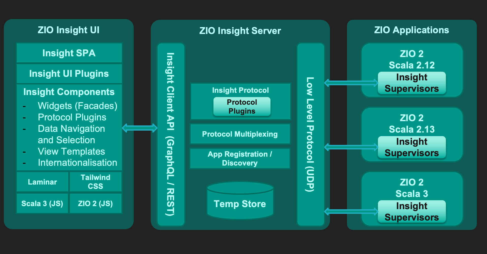
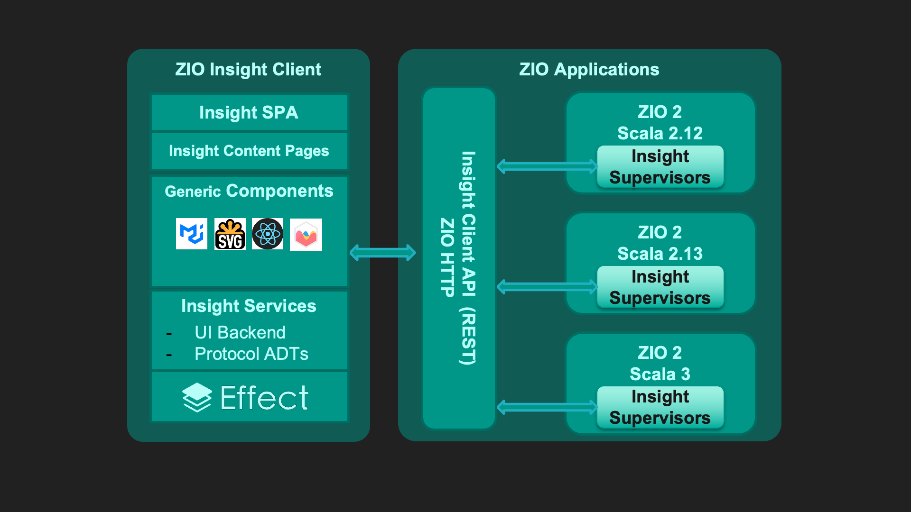

<h1 style="margin-top: 2em">ZIO Insight</h1>

<h2 style="margin-top: 1.5em">Andreas Gies</h2>

Software Engineer at @Ziverge

---



---



---

# ZIO Insight Server 

## Instrumentation for ZIO 2 applications 
- Ready to go ZIO Http Server with ZIO Insight routes
  - Expose ZIO metrics from a ZIO Metrics Connectors endpoint
  - Expose Fiber infos collected by a ZIO Insight Supervisor

- Adaptable for other HTTP server implementations 

--- 

# ZIO Insight UI

- Single Page Application leveraging Effect, a ZIO inspired Effect system in Typescript
  - Simple Dashboarding
  - Metrics Dashboard based on Chart.JS for metrics visualization
  - Force graph simulation for Fiber hierarchies with filtering and access to Fiber Stacktraces

--- 

# Client Side Effects

```typescript
export interface GraphDataService {
  id: string
  setMetrics: (keys: HashSet<InsightKey>) => Effect<never, never, void>
  metrics: Effect<never, never, HashSet<InsightKey>>
  setMaxEntries: (newMax: number) => Effect<never, never, void>
  maxEntries: Effect<never, never, number>
  latest: Effect<never, never, GraphData>
  subscription: Queue.Dequeue<string>
  close: Effect<never, never, void>
}
```

<p style="text-align:center">
  
</p>

---

# A small sample program 

```scala
  val program = for {
    _ <- gaugeSomething.schedule(Schedule.spaced(500.millis).jittered).forkScoped
    _ <- observeNumbers.schedule(Schedule.spaced(400.millis).jittered).forkScoped
    _ <- observeKey.schedule(Schedule.spaced(300.millis).jittered).forkScoped
    _ <- doSomething.catchAll(_ => ZIO.unit).schedule(Schedule.spaced(200.millis).jittered).forkScoped
    _ <- FiberTree.run(2, 3, 3).forever.forkScoped
  } yield ()
```

```scala
def run(minChildren: Int, maxChildren: Int, maxDepth: Int): ZIO[Scope, Nothing, Int] =
    for {
      cnt <- ZIO.randomWith(_.nextIntBetween(minChildren, maxChildren))
      res <- ZIO.foreachPar(0.to(cnt)) { _ =>
               if (maxDepth > 0) run(minChildren, maxChildren, maxDepth - 1)
               else
                 for {
                   d <- ZIO.randomWith(_.nextIntBetween(30, 60))
                   f <- ZIO.randomWith(_.nextIntBetween(0, 10)).schedule(Schedule.spaced(200.millis)).forever.forkScoped
                   _ <- f.interrupt.delay(d.seconds)
                 } yield cnt
             }
    } yield res.sum
```
---

# Providing the ZIO Insight Services

```scala
    (for {
      f <- ZIO.never.forkScoped
      _ <- program
      _ <- Server.serve[InsightPublisher with FiberEndpoint](InsightServer.routes)
      _ <- f.join
    } yield ())
      .provideSome[Scope](
        ZLayer.succeed(ServerConfig.default.port(8080)),
        Server.live,
        ZLayer.succeed(MetricsConfig(5.seconds)),
        insight.metricsLayer,
        Runtime.enableRuntimeMetrics,
        Runtime.enableFiberRoots,
        DefaultJvmMetrics.live.unit,
        FiberEndpoint.live,
        ZLayer.succeed(fiberSupervisor),                   
        fiberSupervisor.gc
      )
      .supervised(fiberSupervisor)
```

--- 

# Live Demo 

--- 

# Next Steps

- More Navigation / Filtering for fibers and traces
- Gantt Charting for a selected root fiber 
- Dashboard save / restore 
- Finish implementation of Generic Dashboard Frames
- Service Dependency Graphs 
- Ongoing Code Cleanup : More Effect / Less UI 
- Protocol optimization: JSON -> Binary
- Polling protocol -> Web Sockets streaming protocol  

---

# Resources

- https://zio.dev/
  Documentation for all ZIO 2 modules and libraries
- https://effect.website/docs/getting-started 
  Website for Effect, the ZIO inspired Effect system in Typescript
- https://www.chartjs.org/
  The Charting library used to render the metrics
- https://d3js.org/
  A powerful visualization framework for large data sets
- https://react.dev/learn
  The React documentation 
- https://mui.com/
  Material UI is currently used as a component library for the UI

---

# Thank you 

## Check out the code and start exploring 
- ZIO Insight UI :  https://github.com/zio/zio-insight-ui
- ZIO Insight Server : https://github.com/zio/zio-insight-server
- __atooni__ on Discord and Github 
- __@andreasgies__ on Twitter
- Join the Discord Servers : 
  - https://discord.gg/cUkQdZn8 -- All things ZIO
  - https://discord.gg/effect-ts -- All things Effect 
